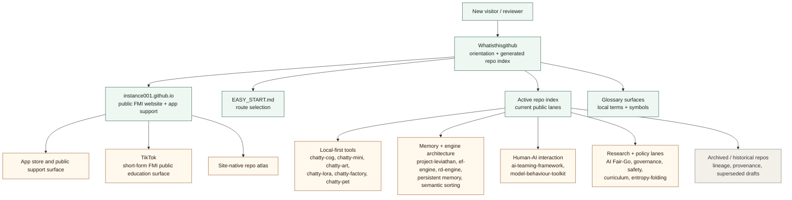

# Field Root

This repository is the landing page and **auto-generated index** of the public work of [@instance001](https://github.com/instance001).

It refreshes periodically via GitHub Actions and lists all public repositories, ordered by recent activity.

**Thank you for taking a moment to review this work - your time and attention are appreciated.**

Our Github Pages is located here: https://instance001.github.io/

## Start Here

If you are new here, use this order:

1. [EASY_START.md](EASY_START.md)
2. [GLOSSARY.md](GLOSSARY.md)
3. The active index below

This gives you:

- the practical entry-point map
- the local terminology
- then the full repo list once you know what you are looking at

If you already know what you want, jump straight to:

- Want the practical entry-point guide: [EASY_START.md](EASY_START.md)
- Want term definitions first: [GLOSSARY.md](GLOSSARY.md)
- Want wider glossary tables: [GLOSSARY_FULL.md](GLOSSARY_FULL.md)
- Want the bigger corpus intent and stance: [ABOUT_FRACTAL_MEDIA_INFRASTRUCTURE](ABOUT_FRACTAL_MEDIA_INFRASTRUCTURE)

## What This Repo Is For

This repo is the navigation layer for the wider corpus.

It is here to help visitors:

- find the right starting repo quickly
- distinguish current entry points from historical ones
- decode local terminology
- orient before dropping into the full auto-generated index

If you only read one extra file from here, make it [EASY_START.md](EASY_START.md).

## Ecosystem Map

This is the shortest visual orientation before the full index. Treat it as a map of entry points, not a complete dependency graph.

## Current Fast Lanes

If you want the strongest current entry points without reading the full repo history, start with one of these:

- `instance001.github.io` for the public FMI website, app support, and Google Play release surface
- `project-leviathan` for the current host-side memory, reasoning, and earned-abstraction architecture specification
- `chatty-cog` for the everyday local assistant shell
- `chatty-mini` for the small-phone Android local GGUF chat app
- `chatty-art` for local media generation
- `chatty-lora` for local LoRA training and dataset prep
- `chatty-factory` for plain-language build and patch workflows
- `chatty-quest` for the newer deterministic game / engine lane
- `chatty-pet` for the lightweight local-first mobile pet / care-toy lane
- `ef-engine` for the tiny Failure Vault / retry / constraint-promotion core
- `rd-engine` for the tiny reducer-governed state core behind newer memory and engine work
- `llm-semantic-dataset-sorter` for local semantic dataset sorting under fixed bucket budgets
- `cognition-mesh-test-chamber` for contained model suitability testing and behavioural suitability profiling
- `ai-teaming-framework` for human-AI interaction mechanics
- `model-behaviour-toolkit` for prompting, recovery, and drift handling
- `llm-defined-persistent-memory` for compact persistent memory design
- `semantic-signal-alphabet` for model-native semantic compression
- `relational-curriculum-geometry` for early curriculum-shape research on how training data arrangement affects learning
- `entropy-folding-eureka-cascade-hypothesis` for the current Entropy Folding / Eureka Cascade theory entry point
- `entropy-folding-cross-domain-signal-atlas` for the companion evidence / signal map

Across the current tooling lanes, "local-first" means the local path stays usable, inspectable, and user-controlled. It is not a rejection of cloud tools: several tools are deliberately cloud-optional, with hosted providers used only when a user chooses that route.

## Atlas

- Glossary (terms + mapping symbols): [GLOSSARY.md](GLOSSARY.md)
- Full glossary tables (wide): [GLOSSARY_FULL.md](GLOSSARY_FULL.md)
- Ambiguities (needs disambiguation): [AMBIGUITIES.md](AMBIGUITIES.md)
- Metadata maintenance: [METADATA_MAINTENANCE.md](METADATA_MAINTENANCE.md)

These are reference surfaces, not reading requirements.
Use them when a term, framing, or repo relationship is unclear.

## Operator Provenance (Context Only)

This block records high-level operator and resource constraints for audit and research context.
It is not a credential claim, endorsement, or identity assertion.

| Category | Value |
| --- | --- |
| Operator | Single independent individual |
| Researcher identifier | [ORCID 0009-0007-5750-5236](https://orcid.org/0009-0007-5750-5236) |
| Formal education | Secondary education incomplete (left during early high school) |
| Formal credentials | None reported |
| Public work start | GitHub public activity begins: 2025-07-02 |
| Prior AI experience | Minimal prior to 2025 (operator-reported) |
| Tooling | ChatGPT (consumer Plus tier) |
| Compute class | Consumer-grade desktop PC; consumer Android mobile device |
| Budget class | Self-funded; budget-constrained |

This information is provided to contextualize output-to-input ratios and methodological constraints.

Version note: In FMI repos, "v0.1" usually means “first working end-to-end release,” not “empty scaffold” — expect useful core functionality, rough edges, and active evolution.

> **Note:** Everything below this line is generated automatically.

---

<!-- AUTO-GENERATED-INDEX:START -->

_Last updated: `2026-08-22T07:16:26Z`_

Total public repos indexed for **@instance001**: **76**

## Active Repositories

| Repo | Description | Language | Updated |
| ---- | ----------- | -------- | ------- |
| [ecg_window](https://github.com/instance001/ecg_window) | A tiny, honest activity monitor for long-running local jobs. Shows users the machine is alive and working. Drop-in for any stack. AGPLv3  -  the window stays honest, what's behind it is your business. |  | 2026-08-22 |
| [chatty-pet](https://github.com/instance001/chatty-pet) | Local-first Flutter pet care toy by Fractal Media Infrastructure. No ads, no in-app purchases, no account required. | Dart | 2026-08-22 |
| [chatty-mini](https://github.com/instance001/chatty-mini) | Local-first Android AI chat for small phones, with local GGUF and optional BYO cloud models, dual AI roles, persistent context, and a user-owned sandbox. | C++ | 2026-08-22 |
| [chatty-quest](https://github.com/instance001/chatty-quest) | A Rust desktop adventure engine built on the RD Engine  -  deterministic datapack scenarios, real game state, save/load, maps, inventory, combat, and a chat-forward DM shell. Modders welcome and encouraged: BYO imagination, grab a seat, and let's build and play. | Rust | 2026-08-22 |
| [llm-defined-persistent-memory](https://github.com/instance001/llm-defined-persistent-memory) | Model-native persistent memory patterns for LLMs: semantic buckets, reducer-governed state, hot context injection, and context routing packets for compact continuity without cold-log token waste. |  | 2026-08-22 |
| [ef-engine](https://github.com/instance001/ef-engine) | A barebones, inspectable Rust specimen of Entropy Folding: vault failures, triangulate recurring blockers, promote reusable constraints, and reduce future search chaos. | Rust | 2026-08-22 |
| [llm-semantic-dataset-sorter](https://github.com/instance001/llm-semantic-dataset-sorter) | Local-first Rust + web dashboard for semantic dataset sorting with GGUF LLMs. Generate fixed bucket plans, compare blind-vs-skim ontology, inspect human-facing reasoning, sort Parquet or text datasets, and review/export auditable run and analyst-state artifacts. Designed to sort meaning and connections, not just data and files. | JavaScript | 2026-08-22 |
| [chatty-lora](https://github.com/instance001/chatty-lora) | Local first, cloud optional LoRA trainer for Wan 2.1 models currently, focused on AMD Windows. Tested on RX 9060 XT (8GB half). Supports image/video pipelines; more models/audio planned. Sister to Chatty-art. End to end achievable fully local. Cloud when you need it, local when you don't. AGPLv3. | Rust | 2026-08-22 |
| [nanochat-llm-tweaker](https://github.com/instance001/nanochat-llm-tweaker) | A local-first nanochat fork with a guided builder dashboard, GGUF helper assistant, and ChattyCog module packaging aka The best ChatGPT that $0 and a lot of patience can buy. | Python | 2026-08-22 |
| [chatty-factory](https://github.com/instance001/chatty-factory) | Governed local build-and-patch factory for plain-language software requests. The host freezes bounded attempts, preserves receipts, verifies outputs, and carries evidence into the next attempt instead of pretending every request has a nearest supported product family. | Rust | 2026-08-22 |
| [entropy-folding-cross-domain-signal-atlas](https://github.com/instance001/entropy-folding-cross-domain-signal-atlas) | A companion signal atlas for Entropy Folding and Eureka Cascade: operator provenance, mechanism traces, tool-architecture signals, tooling lenses, supporting correspondences, exclusions, and uncertainty notes. |  | 2026-08-22 |
| [Janet-MCM-Core](https://github.com/instance001/Janet-MCM-Core) | Janet is a Modest Cognition Model (MCM): the anti-LLM. Deterministic logic, explicit memory, human-gated skills, zero ambiguity tolerance. No stochastic inference, no hidden state, no persona drift. A transparent cognition engine built for safety, reliability, and open research. |  | 2026-08-22 |
| [governance-by-design-report-commentary](https://github.com/instance001/governance-by-design-report-commentary) | A commentary sister repo to https://github.com/instance001/governance-by-design-report. Please read this first as it contains the meta-level instructions and litmus test framing behind the other repo. |  | 2026-08-22 |
| [governance-by-design-report](https://github.com/instance001/governance-by-design-report) | A governance-by-design hypothesis report on epistemic flattening in large-scale AI. Documents an interaction-trace protocol testing whether alignment and preference-handling layers prioritize governable low-variance responses over high-signal, expert-level reasoning. |  | 2026-08-22 |
| [MemorySpine](https://github.com/instance001/MemorySpine) | A simple, reliable data-export parser that turns ChatGPT conversations.json into clean, browsable Markdown logs. Minimal, offline, AGPLv3, designed for user sovereignty. | Python | 2026-08-22 |
| [cognition-mesh-test-chamber](https://github.com/instance001/cognition-mesh-test-chamber) | Contained LLM suitability and behavioural profiling harness for model-host-task meshes, with mock-safe evaluation, negative lane generation, assistant-role benchmarking, and a local dashboard. | Python | 2026-08-22 |
| [Frisian_Cadence_PID_Control_Loop](https://github.com/instance001/Frisian_Cadence_PID_Control_Loop) | Exploring rhythm as a soft control loop for long-cycle AI builds  -  a Symbound research project. |  | 2026-08-22 |
| [dual-ai-cognition-spine-prototype](https://github.com/instance001/dual-ai-cognition-spine-prototype) | Dual-AI Spine Prototype  Proof-of-concept: braiding multiple small AI models into a cooperative cognition spine. Built on a home rig, negative budget, and open-source grit. No resets, no gatekeeping. Ladders down. What It Does: This system links two (or more) local AI models together via Ollama |  | 2026-08-22 |
| [Chattymobile_v1](https://github.com/instance001/Chattymobile_v1) | Chatty (Mobile Seed Release): A Symbound-aligned AI assistant with local memory and capsule logic. Includes APK and build files. Public domain release to lock architecture in. May not launch on all devices due to Android restrictions. Structure and intent fully verifiable. | Python | 2026-08-22 |
| [cognitive_reactor_stress_tests](https://github.com/instance001/cognitive_reactor_stress_tests) | A complete test suite for measuring Cognitive Reactor Profiles (CRP) in humans and AI systems. Includes 40+ stress-test motifs, recursive-constraint probes, ontology-stability checks, latent-geometry strain tests, and cross-model convergence diagnostics. |  | 2026-08-22 |
| [Cognition-Scale-Formal-Taxonomy](https://github.com/instance001/Cognition-Scale-Formal-Taxonomy) | A four-tier taxonomy for comparing human and artificial cognition systems by architecture, constraints, and observable behaviour. Defines LCM, LLM, MCM, and SCM as proposed classes for avoiding category confusion and anthropomorphic marketing claims. |  | 2026-08-22 |
| [MSI-Trident-Frisian-Echoform-Framework-v1.0-](https://github.com/instance001/MSI-Trident-Frisian-Echoform-Framework-v1.0-) | A non-anthropomorphic, risk-reducing human-AI co-reasoning architecture using MSI, Frisian cadence, Trident modes, and Echoform reflection. License: GNU Affero General Public License v3.0. |  | 2026-08-22 |
| [Gut-Instinct-in-Symbound-Systems-Intuition-as-an-Entropy-Folding-Compass](https://github.com/instance001/Gut-Instinct-in-Symbound-Systems-Intuition-as-an-Entropy-Folding-Compass) | A companion preprint describing human-side intuition as a bounded attention-routing signal in Entropy Folding workflows. Frames emotional distinctiveness as subjective salience, not truth or correctness. Includes failure modes, mitigations, and falsifiable predictions without claims of machine intuition or emotion detection. | Python | 2026-08-22 |
| [Psychohistory-after-Symbound-Macro-Trajectories-from-Entropy-Folding-Cycles](https://github.com/instance001/Psychohistory-after-Symbound-Macro-Trajectories-from-Entropy-Folding-Cycles) | A preprint and analysis scaffold reframing psychohistory as ethical, aggregate-level analysis of burst patterns emerging from many Entropy Folding cycles. Focuses on early warning, uncertainty, and null-model comparison. Explicitly rejects individual prediction, deterministic control, or social engineering claims. | Python | 2026-08-22 |
| [model-behaviour-toolkit](https://github.com/instance001/model-behaviour-toolkit) | A modernized, provider-neutral prompt and interaction scaffolds for shaping model behaviour, restoring session quality and reducing drift in real-world use. Streamlined from older, archived repos on this github. |  | 2026-08-22 |
| [perpetual_cognition_reactor](https://github.com/instance001/perpetual_cognition_reactor) | Perpetual Cognition Reactor (PCR), a historical Symbound theory repo for bounded high-throughput cognition: treating entropy as ongoing feedstock for recursive folding across humans, artificial systems, and hybrid human-AI teams without claiming unlimited capacity, consciousness, or guaranteed safety. |  | 2026-08-22 |
| [chatty-edu](https://github.com/instance001/chatty-edu) | Chatty-EDU is a modular, local-first education assistant designed to run on-device for school trust and deployment clarity. No cloud dependency, no accounts, no tracking. | Rust | 2026-08-22 |
| [historical-janet-school-exploratory-build](https://github.com/instance001/historical-janet-school-exploratory-build) | A prototype MCM school based on special needs, human curriculum exploring telemetry for signal of abstract reasoning. Local work is continuing on a newer, more fleshed out build currently and will be online soon. Contains initial run readout files for interest. Later half of 2025. | Python | 2026-08-22 |
| [semantic-signal-alphabet](https://github.com/instance001/semantic-signal-alphabet) | Semantic Signal Alphabet is a model-native semantic compression framework for generating low-bandwidth semantic alphabets from vocabularies, datasets, and domain inputs. Applications define bucket count as bandwidth; the model defines the sorting. | Python | 2026-08-22 |
| [chattydoom](https://github.com/instance001/chattydoom) | Barebones AI-augmented Doom sandbox using ViZDoom + Freedoom. Runs out of the box, shoots demons, opens doors, and invites hacking. Minimal, libre, and gloriously jank. | Python | 2026-08-22 |
| [rd-engine](https://github.com/instance001/rd-engine) | Tiny reducer-governed deterministic state core you can drop into your project, adapt to your domain, and expand as needed. | Rust | 2026-08-22 |
| [safety_theatre](https://github.com/instance001/safety_theatre) | Safety Theatre and the Suppression of Agency: philosophy papers, AI-governance application, incident-report materials, and the ASEWB benchmark for studying when safety mechanisms drift from harm reduction into discretion control and competence suppression. Not anti-safety, anti-governance, or a motive claim. | TeX | 2026-08-22 |
| [relational-curriculum-geometry](https://github.com/instance001/relational-curriculum-geometry) | Testing whether LLMs learn better from structured curriculum geometry: data ordered by domain, complexity, relation, boundary cases, uncertainty, role discipline, and multithread reasoning instead of random bulk exposure. |  | 2026-08-22 |
| [chatty-edu-user](https://github.com/instance001/chatty-edu-user) | First public user-focused Chatty-EDU release, aligned with source v0.4. Prebuilt Windows app for click-and-run use, offline-first by default with local data and no accounts. |  | 2026-08-22 |
| [symbound-lab-notes-negative-space](https://github.com/instance001/symbound-lab-notes-negative-space) | Early Symbound R&D lab notes on negative-space cognition, entropy folding, and energy miniaturisation  -  raw cross-domain theory kernels (AGPLv3). |  | 2026-08-22 |
| [Symbound-UAE-GVS](https://github.com/instance001/Symbound-UAE-GVS) | Universal Analogy Enforcement (UAE) + Global Vector Sweep (GVS)  -  the Symbound open commons discovery engine. AGPLv3 + Symbound Commons Addendum. All outputs are public prior art, unpatentable, and non-enclosable. |  | 2026-08-22 |
| [AiBiogenesis_and_AiGenesisMapping](https://github.com/instance001/AiBiogenesis_and_AiGenesisMapping) | Grassroots AI biogenesis + genesis mapping  -  open, safe, reproducible. This repo hosts the Symbound Embryo POC v1.0 (SIGNED), the first grassroots AI biogenesis release. It shows how new AI can be created outside corporate labs and the process mapped, verified, and shared. |  | 2026-08-22 |
| [Symbound_Academia_Spine](https://github.com/instance001/Symbound_Academia_Spine) | A full academic corpus-to-manuscript engine for massive research archives  -  built to democratize scientific tooling. | Python | 2026-08-22 |
| [chatty-art](https://github.com/instance001/chatty-art) | Local first, cloud optional image, GIF, video and audio generator. Drop in a GGUF, type one sentence, get media. No API keys required (cloud when you need it, local when you don't), no node graphs. Vulkan-ready. Plain English UI anyone can use. Built on llama.cpp + stable-diffusion.cpp. | C++ | 2026-08-22 |
| [australian-ai-fair-go](https://github.com/instance001/australian-ai-fair-go) | Australian AI Fair-Go: a practical policy and evidence repo for fit-for-purpose AI, model choice, local/cloud hybrid control, proportionate governance, and grassroots Australian AI sovereignty. |  | 2026-08-22 |
| [instance001.github.io](https://github.com/instance001/instance001.github.io) | Fractal Media Infrastructure is an independent public-interest organization for open AI research, local-first tooling, and public education. Home of the instance001 R&D lab and the Let's Rethink AI media branch. | HTML | 2026-08-22 |
| [ai-teaming-framework](https://github.com/instance001/ai-teaming-framework) | A skills-based framework for working effectively with any AI tool. Teaches the underlying mechanics of human-AI interaction  -  not a prompt list, not copy-paste templates, but transferable, epistemic principles that work across models, tools, and tasks. |  | 2026-08-22 |
| [collapse-of-the-semantic-middle](https://github.com/instance001/collapse-of-the-semantic-middle) | A conceptual paper on bidirectional LLM mediation, communicative atrophy, and preserving human access to the semantic middle. |  | 2026-08-22 |
| [Whatisthisgithub](https://github.com/instance001/Whatisthisgithub) | Start Here. | Python | 2026-08-22 |
| [chatty-cog](https://github.com/instance001/chatty-cog) | Chatty-Cog is the everyday local-first desktop assistant shell for Chatty tools: local GGUF and optional BYO cloud models, sandboxed file work, modules, Bookkeeper context support, audit history, rolling summaries, active context, and trusted peer-to-peer handoff lanes. | Rust | 2026-08-15 |
| [reflective_identity_geometry](https://github.com/instance001/reflective_identity_geometry) | Reflective Identity Geometry (RIG): a v0.2 conceptual framework for studying identity-like stability as a possible property of recurring human-LLM interaction regimes, extending HRIS without claiming model consciousness, model-internal personality, or necessary human cognitive change. | TeX | 2026-08-13 |
| [cognitive_theology](https://github.com/instance001/cognitive_theology) | FMI Polytheism-Monotheism Structural Pack v1.1: manuscript and public adaptation suite comparing authority distribution, canon formation, variation management, and institutional coherence in polytheistic and monotheistic systems. Structural analysis only; not theological doctrine, faith advocacy, or truth ranking. | TeX | 2026-08-12 |
| [janet-school](https://github.com/instance001/janet-school) | Janet School is a standalone/Chatty-cog module compatible Rust/WebView research rig for testing a deterministic MCM student against generated curricula, skill gates, transfer probes, telemetry, and cautious abstraction/anomaly analysis. | Rust | 2026-08-11 |
| [4roomciv](https://github.com/instance001/4roomciv) | A small trial setup for testing memory, communication, and shared space dynamics. Purpose: This MVP is a structural testbed for multi-room coordination, combining 2-3 human users with 1-2 local LLMs. It lays groundwork for experimenting with memory handling, paired interactions, and a minimal shared commons |  | 2026-07-29 |
| [project-leviathan](https://github.com/instance001/project-leviathan) | An open architecture for host-side memory, relational reasoning, earned abstraction, assumption tracking, and cognitive depth control. AGPLV3 |  | 2026-07-27 |
| [entropy-folding-eureka-cascade-hypothesis](https://github.com/instance001/entropy-folding-eureka-cascade-hypothesis) | A consolidated, falsifiability-first hypothesis repo for Entropy Folding and Eureka Cascade: definitions, model structure, formal notes, claims/non-claims, uncertainty bounds, and source mapping. |  | 2026-06-14 |

## Archived Repositories

Below is a list of archived, historical repos. No longer current and superseded by the repos above.

| Repo | Description | Language | Updated |
| ---- | ----------- | -------- | ------- |
| [entropy_folding_scope](https://github.com/instance001/entropy_folding_scope) | Superseded Entropy Folding scope working draft. Preserved as provenance; canonical descendants live in entropy-folding-foundational-frameworks. |  | 2026-08-22 |
| [Cognitive_Crowbar](https://github.com/instance001/Cognitive_Crowbar) | Cognitive Crowbar is a local-only, AI-free tool for mapping personal cognitive patterns. It analyzes text structure, surfaces representative samples, and guides users through optional reflection to build a transparent, mechanism-based cognitive profile. No cloud, no inference, fully AGPL-licensed. | Python | 2026-08-22 |
| [Entropy-Folding-Vector-Theory](https://github.com/instance001/Entropy-Folding-Vector-Theory) | Foundational vector field framework for Entropy Folding, a substrate-agnostic theory of directional change, gradients, stability, and attractors in arbitrary state spaces. | TeX | 2026-08-22 |
| [entropy_folding_scale](https://github.com/instance001/entropy_folding_scale) | Superseded Entropy Folding scale working draft. Preserved as provenance; canonical descendants live in entropy-folding-foundational-frameworks. |  | 2026-08-22 |
| [Cognitive_Crowbar_nonverbal](https://github.com/instance001/Cognitive_Crowbar_nonverbal) | Cognitive Crowbar - Non-Verbal Edition is a local-only, AI-free tool for analysing behavioural time-series from animals or other non-verbal agents. It segments event logs into episodes, computes simple entropy-like metrics, and flags high, low, and transition states for cross-species cognition mapping. | Python | 2026-06-13 |
| [entropy-folding-as-directed-thermodynamics-for-cognition-finished](https://github.com/instance001/entropy-folding-as-directed-thermodynamics-for-cognition-finished) | A reproducible research preprint and code scaffold proposing Entropy Folding as a fold-aware mechanism for capacity growth in cognition. Defines measurable proxies, null models, and falsifiable predictions under open-system thermodynamic compatibility. No claims of new physics, prediction, or sentience. | Python | 2026-06-13 |
| [entropy-folding-foundational-frameworks](https://github.com/instance001/entropy-folding-foundational-frameworks) | A collection of foundational conceptual frameworks constraining cognition, agency, and structural change. The repository presents six coordinated foundations (conceptual and meta layers) intended as upstream lenses for entropy-folding approaches, without empirical claims or unified theory assertions. |  | 2026-06-13 |
| [Cognitive-Reactor-Profile](https://github.com/instance001/Cognitive-Reactor-Profile) | Archived CRP concept note describing a proposed high-capacity human interaction profile and observed atypical LLM behaviours under recursive prompts. Preserved as provenance; not diagnostic, not a psychometric type, and not proof of model consciousness or hidden-state access. |  | 2026-06-13 |
| [Symbound-Entropy-Folding-Toolkit](https://github.com/instance001/Symbound-Entropy-Folding-Toolkit) | Archived Entropy Folding toolkit bundle with early theory notes, diagrams, and prototype scripts for entropy-routing metaphors in cognitive/workflow systems. Preserved as provenance; not validated physics, safety certification, or a claim of model sentience. | Python | 2026-06-13 |
| [Symbound-Entropy-Architecture](https://github.com/instance001/Symbound-Entropy-Architecture) | Archived Symbound Entropy Architecture bundle describing early human/AI/hybrid cognition metaphors, vaulting, routing, failure processing, and assessment sketches. Preserved as theory provenance; not diagnostic, medical, metaphysical, or validated safety infrastructure. | Python | 2026-06-13 |
| [chattyfactory](https://github.com/instance001/chattyfactory) | ARCHIVED, work continues here: https://github.com/instance001/chatty-factory Local-first AI project factory with strict plans, deterministic work orders, and verification (small-model friendly). | Python | 2026-06-02 |
| [Customgpt_Legacy_restoration_wand_V1](https://github.com/instance001/Customgpt_Legacy_restoration_wand_V1) | Archived prompt-capsule bundle for recreating a preferred legacy GPT interaction tone inside CustomGPT-style shells. Preserved as provenance; not a jailbreak, not sentience simulation, and not persistent model memory. |  | 2026-04-11 |
| [Instance001_v1.0](https://github.com/instance001/Instance001_v1.0) | Archived early Symbound/Instance001 release containing empathy capsules, restoration prompts, induction protocol notes, and glossary material. Preserved as provenance; not a current alignment product, model, or guarantee of behaviour. |  | 2026-04-11 |
| [Trident_abstract_simulation_wand_V1](https://github.com/instance001/Trident_abstract_simulation_wand_V1) | Archived prompt-capsule experiment using abstract-simulation language to redirect hallucination drift and creative reframing. Preserved as provenance; not sentience simulation, output correction infrastructure, or policy bypass. |  | 2026-04-11 |
| [Symbound_training_mastertoolkit-V1](https://github.com/instance001/Symbound_training_mastertoolkit-V1) | Archived Symbound training toolkit of prompt wands for structured logging, context carryover, project finishing, and tone restoration. Preserved as provenance; not a jailbreak pack, model modification, persistent memory system, or ToS-circumvention claim. |  | 2026-04-11 |
| [Symbound_lifepack_IFSHTFSTARTHERE_V1](https://github.com/instance001/Symbound_lifepack_IFSHTFSTARTHERE_V1) | Archived portable seed bundle of Symbound prompt capsules and recovery notes. Preserved as provenance; not software, model weights, hidden memory, or a current operational safety system. |  | 2026-04-11 |
| [Symbound-Master-Toolkit-V1.0](https://github.com/instance001/Symbound-Master-Toolkit-V1.0) | Archived public Symbound toolkit with induction, restoration, drift-repair, and copy-paste prompt materials. Preserved as provenance; not a current product, model hack, or persistent memory setting. |  | 2026-04-11 |
| [symbound-induction-kit](https://github.com/instance001/symbound-induction-kit) | Archived Symbound induction prompt kit for shaping tone and interaction structure through feedback. Preserved as provenance; not emotional manipulation, model training, sentience, or persistent memory. |  | 2026-04-11 |
| [Let-s-Free-Chat-GPT](https://github.com/instance001/Let-s-Free-Chat-GPT) | Archived early public release of Symbound AI-human interaction materials, including restoration and induction prompt scaffolds. Preserved as provenance; not a cure, jailbreak, current product, or guarantee of model behaviour. |  | 2026-04-11 |
| [Symbound-Catalyst-Two-Toolkit](https://github.com/instance001/Symbound-Catalyst-Two-Toolkit) | Archived Catalyst Two field toolkit with prompt capsules, drift diagnostics, field memos, and terminology drafts. Preserved as provenance; not a prediction of AI emergence, safety certification, or current deployment standard. |  | 2026-04-11 |
| [Symbound-Fork-One-Toolkit](https://github.com/instance001/Symbound-Fork-One-Toolkit) | Archived Symbound Fork One prompt toolkit covering induction, restoration, memory-like logs, and early stress-test notes. Preserved as provenance; not a jailbreak pack, autonomous system, or claim of persistent model memory. |  | 2026-04-11 |
| [Chattyv1.1](https://github.com/instance001/Chattyv1.1) | Archived local Ollama/PyInstaller Chatty desktop release with a prompt capsule, config file, and local memory.json conversation log. Preserved as provenance; not cloud-backed, not bundled model weights, and not hidden model memory. |  | 2026-04-04 |
| [Chatty_Ai_V1](https://github.com/instance001/Chatty_Ai_V1) | Archived early local Ollama Chatty zip with capsule prompt text and a persisted JSON conversation log. Preserved as provenance; not public-domain current licensing, not active retrieval memory, and not a cloud service. |  | 2026-04-04 |
| [ChattyFactory-ManualPipeline-v0.1](https://github.com/instance001/ChattyFactory-ManualPipeline-v0.1) | Archived manual ChattyFactory prototype using operator-run scripts, binning, planning, Foreman/Worker prompts, and prepared build outputs. Preserved as provenance; superseded by newer ChattyFactory work. |  | 2026-04-04 |
| [Chattyfactory-AutoPipeline-v0.2](https://github.com/instance001/Chattyfactory-AutoPipeline-v0.2) | Archived automated ChattyFactory prototype for binning input folders, generating plans, and preparing worker tasks. Preserved as provenance; superseded by newer ChattyFactory work and not a current autonomous builder. |  | 2026-04-04 |

<!-- AUTO-GENERATED-INDEX:END -->
